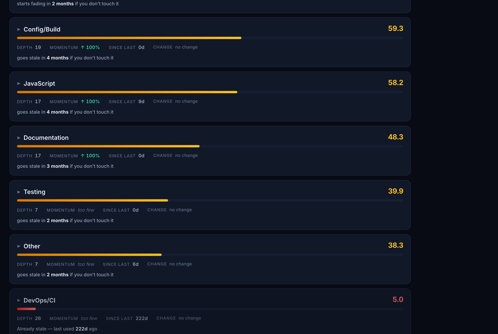
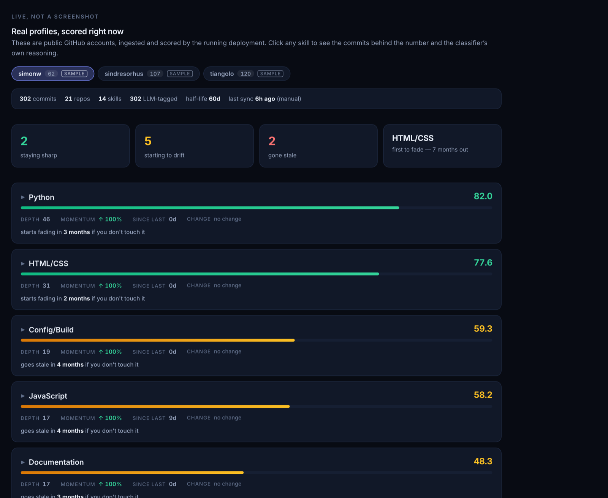
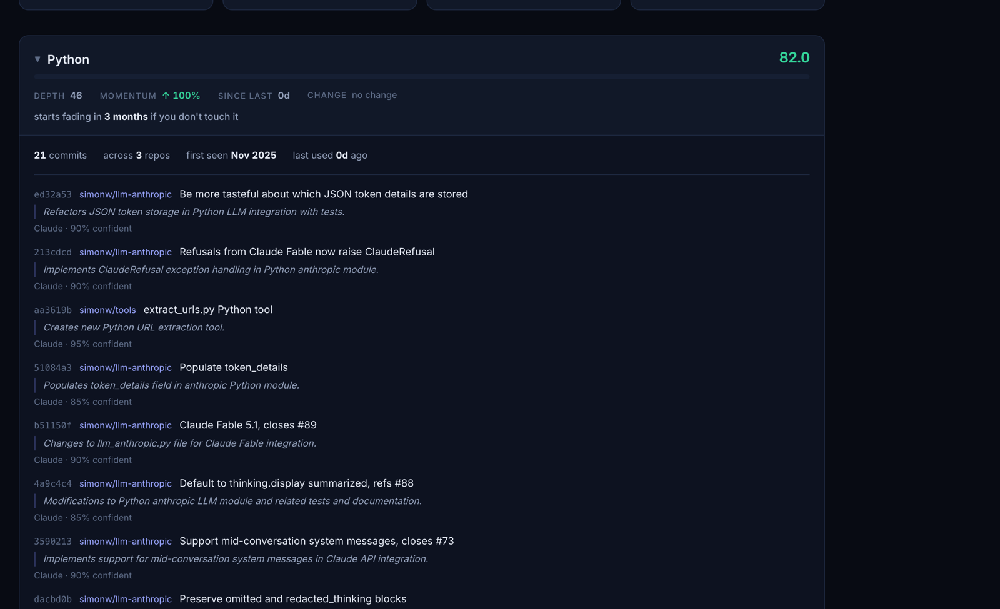
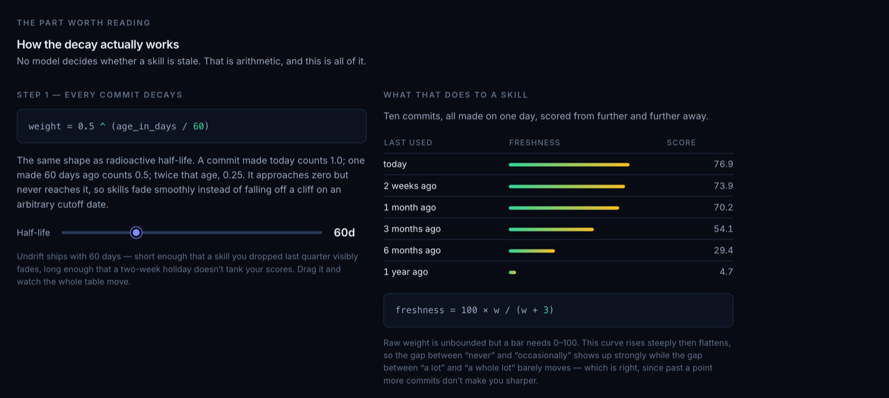

<div align="center">

# Undrift

### Your skills are decaying right now. This shows you which ones.

Undrift reads your real commit history, asks Claude which skill each commit
exercised, and scores every one of them on a decay curve — so the fading is
something you can **see** instead of something you find out in an interview.

[**Open the live dashboard →**](https://undrift-supreeth-chittaluri.vercel.app)

`FastAPI` · `Claude API` · `Postgres` · `React` · `Render + Vercel` · `GitHub Actions`



</div>

---

## The problem

Every résumé has a skills section. Almost none of them have evidence behind it,
and none of them have a date. "Python, React, AWS, Docker, SQL" says nothing
about whether you touched any of it this year.

Meanwhile the actual decay is invisible while it happens. You don't notice
Docker going stale — you notice it in an interview, eight months later.

Undrift makes both things visible, from data you're already generating.



## Three numbers, not one

Freshness alone can't tell these two people apart:

- **A** — wrote Java daily for three years, then stopped eight months ago.
- **B** — touched Java twice, last week, and never otherwise.

Both land at roughly the same score, and the honest advice is opposite: A has a
real skill going stale and worth reviving; B never had one. So every skill
carries three numbers that answer different questions.

| | Question | Behaviour |
|---|---|---|
| **Freshness** | How recently and how heavily have you used it? | Decays |
| **Depth** | How much evidence is there that you know it at all? | Never decays |
| **Momentum** | Are you using it more or less than before? | Signed, −100…+100 |

Person A reads *low freshness, high depth, negative momentum* — you're losing
something you paid for. Person B reads *low freshness, low depth* — you never
had this. Same freshness, opposite story.

Undrift also **forecasts**: because the decay curve is invertible, it can tell
you a skill goes stale in 41 days if you don't touch it. That's one logarithm,
not a simulation.

## Why do you think I know FastAPI?

This is the part most skill trackers can't answer. Click any skill and Undrift
opens the commits behind the number — with the classifier's own reasoning and
confidence for each one.



Every score is auditable down to individual commits. Each open skill has its own
URL, so "here's why I can claim Python" is a link you can send someone.

---

## The decay formula

This is the part worth understanding, and it is deliberately plain Python — **no
LLM decides whether a skill is stale.** On the live site the half-life is a
slider, and the whole worked example re-scores as you drag it.



**Step 1 — every commit decays exponentially with age.**

```
weight(commit) = 0.5 ** (age_in_days / HALF_LIFE)
```

Same shape as radioactive half-life. A commit made today counts 1.0; one made
`HALF_LIFE` days ago counts 0.5; twice that age, 0.25. It approaches zero but
never reaches it, so skills fade smoothly instead of falling off a cliff on an
arbitrary cutoff date.

`HALF_LIFE` is 60 days by default. That's a judgement call: short enough that a
skill dropped last quarter visibly fades, long enough that a two-week holiday
doesn't tank the score.

| Commit age | Weight |
|---|---|
| today | 1.000 |
| 30 days | 0.707 |
| 60 days | 0.500 |
| 180 days | 0.125 |
| 1 year | 0.015 |

**Step 2 — a skill's raw weight is the sum of its commits' weights.**

```
raw_weight(skill) = Σ weight(commit) for every commit tagged with that skill
```

Summing is what folds in **frequency** as well as recency. One commit last week
scores lower than ten commits last week, because ten near-1.0 weights add up.
Both factors fall out of a single sum rather than needing two terms bolted
together.

**Step 3 — squash it onto a 0–100 scale.**

```
freshness(skill) = 100 * raw_weight / (raw_weight + 3.0)
```

`raw_weight` is unbounded but a progress bar needs 0–100. This curve rises
steeply at first and flattens as it approaches 100, so the gap between "never"
and "occasionally" shows up strongly while the gap between "a lot" and "a whole
lot" barely moves the bar — which is what you actually want, since past a point
more commits don't make you sharper.

The constant `3.0` is what gives the score its meaning: **a skill whose decayed
weight equals 3.0 — roughly three commits in the last few days — sits at exactly
50/100.**

The scale is **absolute, not a ranking**. Scores aren't normalised against the
best skill, so if I stop coding entirely every bar drops toward zero together.
Normalising would always pin something at 100 and hide the very drift this
exists to show.

Deliberately *not* included: lines changed. Weighting by diff size would let one
commit that vendored a dependency outweigh a month of real work.

The formula lives in [`backend/app/scoring.py`](backend/app/scoring.py) with
doctests covering every curve.

---

## How it works

**1. Pull the commits.** GitHub's API, on a schedule. Only metadata — commit
messages and the paths of changed files. Never source code.

**2. Claude labels each one.** One skill per commit, chosen from a fixed
vocabulary of 32. The model picks the label and explains why; it never decides
what's stale.

**3. Plain arithmetic scores it.** Exponential decay, no AI, same answer every
time you run it.

**[ARCHITECTURE.md](ARCHITECTURE.md) explains the data flow in five steps.**

### Two decisions worth defending

**The model must choose from a fixed vocabulary.** If it could answer "Python",
"python3" and "Py" on different commits, those would become three separate
skills and every decay curve would be nonsense. The vocabulary is baked into the
JSON schema as an enum, so the API itself enforces it.

**The LLM only decides *which* skill a commit belongs to.** It is never asked
whether a skill feels stale — that's arithmetic, and it lives in `scoring.py`.
Keeping the judgement call and the maths apart is what makes the numbers
reproducible.

### Classification is batched, and cheap

Commits go up 25 per call rather than one at a time. A single commit is a few
dozen tokens of message and filenames wrapped in a system prompt several times
that size, so one call per commit spends most of its money re-sending the same
instructions.

Measured on the 302-commit sample corpus:

| | Model | Calls | Cost |
|---|---|---|---|
| Before | `claude-opus-5`, one commit per call | 302 | ~$1.70 |
| After | `claude-haiku-4-5`, 25 per call | 13 | **~$0.09** |

Haiku reproduced Opus's labels exactly on the corpus — picking one label from a
fixed enum given a filename list is the easy end of what an LLM does. Every
failure mode degrades rather than breaking: a failed call falls the whole batch
back to a deterministic extension-based tagger, and a merely incomplete response
falls back only for the commits actually missing from it.

---

## Public demo, private data

A login wall on a portfolio project is indistinguishable from a broken link, so
the deployed URL opens on a working dashboard. The split is by **data**, not
just by route:

| | Who | What |
|---|---|---|
| **Public** | anyone | `GET` on the read endpoints, restricted to sample profiles — public GitHub accounts seeded as demo data |
| **Private** | owner only | my own profile, `POST /api/refresh`, and `/docs` — HTTP Basic |

The middleware decides one thing — *were valid credentials presented* — and
records it on the request. Which profiles a caller may see is enforced in the
handlers, where there's a database session to answer it with. A route added
tomorrow is private until it explicitly opts in, which is the right direction
for a mistake to fall.

Set `PUBLIC_DEMO=false` to close the API completely.

### The live card

The image below is generated by the API on request, not committed:

```markdown

```


It renders server-side from the latest scores, so this README shows whatever the
last sync computed. (Give Render's free tier a moment to wake up.)

---

## Running it locally

**Prerequisites:** Python 3.12+, Node 20+.

```bash
git clone https://github.com/supreeth-chittaluri/undrift.git
cd undrift
cp .env.example .env     # then fill it in — see below
```

Set up the backend:

```bash
python3.12 -m venv .venv
./.venv/bin/pip install -r backend/requirements.txt
```

Fill in `.env`. The four that matter:

| Variable | What to put there |
|---|---|
| `ANTHROPIC_API_KEY` | From [console.anthropic.com](https://console.anthropic.com) |
| `GITHUB_TOKEN` | A **fine-grained** token — see the security note below |
| `APP_USERNAME` / `APP_PASSWORD` | Anything; guards your own profile |
| `SAMPLE_PROFILES` | Optional. Public GitHub usernames to seed as demo profiles |

Run the API:

```bash
./.venv/bin/uvicorn app.main:app --app-dir backend --reload --port 8000
```

And the dashboard, in a second terminal:

```bash
npm --prefix frontend install && npm --prefix frontend run dev
```

Open http://localhost:5173. The sample profiles are visible immediately; sign in
with `APP_USERNAME` / `APP_PASSWORD` to see your own. The first refresh pulls
your commits, tags them, and backfills six months of history so the trend chart
has something to draw.

To run the pipeline once from the command line instead:

```bash
PYTHONPATH=backend ./.venv/bin/python -c "from app.db import SessionLocal, init_db; from app.pipeline import run_refresh; init_db(); print(run_refresh(SessionLocal(), 'manual'))"
```

---

## API

Endpoints that report on a person take an optional `?profile=<username>`.
Omitting it falls back to the owner when authenticated, and to the first sample
profile when not.

| Route | Auth | Returns |
|---|---|---|
| `GET /health` | — | Liveness, so Render can probe it |
| `GET /api/profiles` | public | Everyone visible to you, with commit counts |
| `GET /api/skills?profile=` | public\* | Freshness, depth, momentum and forecast per skill |
| `GET /api/skills/history?weeks=26` | public\* | Freshness over time, for the trend chart |
| `GET /api/commits?limit=&skill=` | public\* | The commits behind a skill, and why each was tagged |
| `GET /api/card.svg?profile=` | public\* | The embeddable SVG above |
| `GET /api/status` | public | Row counts and the last sync run |
| `GET /api/session` | **private** | Who you're signed in as |
| `POST /api/refresh?trigger=` | **private** | Runs ingest → tag → score |

\* sample profiles only without credentials.

Interactive docs at `/docs`, behind auth.

## How it stays up to date

Two mechanisms, because one isn't enough:

- **APScheduler** runs inside the API process every `REFRESH_INTERVAL_HOURS`.
  Clean, but it only works while the process is awake.
- **A GitHub Actions cron** ([`.github/workflows/refresh.yml`](.github/workflows/refresh.yml))
  POSTs to `/api/refresh` at 06:00 and 18:00 UTC.

Render's free tier sleeps after ~15 minutes idle, and a sleeping process can't
fire its own timer — so in production `ENABLE_SCHEDULER=false` and the cron is
what actually drives ingestion. The pipeline is idempotent, so an extra run costs
almost nothing: ingestion skips SHAs it already has and tagging skips commits it
already tagged.

---

## Deploying it

Three free accounts, roughly 20 minutes. Do them in this order — each step
produces a value the next one needs.

### 1. Database — Neon

Create a project at [neon.tech](https://neon.tech) and copy the connection
string. `postgres://` and `postgresql://` both work; the app rewrites either to
`postgresql+psycopg://` itself, so paste it unchanged. That rewrite is not
cosmetic — SQLAlchemy resolves a bare `postgresql://` to psycopg2, which this
project doesn't install, so without it the app dies at startup.

Use the **pooled** endpoint (the one with `-pooler` in the host). Neon runs
PgBouncer in transaction mode, which historically broke Python drivers that use
protocol-level prepared statements — but Neon's PgBouncer is 1.22+ and psycopg
3.2+ handles it, so no `prepare_threshold` workaround is needed. If you ever see
`prepared statement "..." already exists`, that assumption has broken; the fix is
`connect_args={"prepare_threshold": None}` in `db.py`.

### 2. Backend — Render

1. **New → Web Service**, connect this repo. Render reads `render.yaml`.
2. Fill in the secrets it prompts for: `DATABASE_URL`, `GITHUB_TOKEN`,
   `ANTHROPIC_API_KEY`, `APP_USERNAME`, `APP_PASSWORD`, `SAMPLE_PROFILES`.
   Leave `ALLOWED_ORIGINS` blank for now — you get that value in step 3.
3. Wait for the first deploy, then confirm it's alive:
   `curl https://<your-service>.onrender.com/health`

The first refresh classifies every ingested commit — around 20 seconds and under
a dime for three sample profiles.

### 3. Frontend — Vercel

1. **Add New → Project**, import this repo, set **Root Directory** to `frontend`.
2. Add environment variable `VITE_API_URL` = your Render URL (no trailing slash).
3. Under **Settings → Deployment Protection**, set Vercel Authentication to
   **Disabled**. It is on by default, and it gates *every* generated URL behind
   your own Vercel login — which would make the public demo unreachable to
   everyone but you.
4. Deploy.

### 4. Close the loop

- Back on Render, set `ALLOWED_ORIGINS` to your exact Vercel URL and redeploy.
  Without this the browser blocks every API call as a CORS violation. Use the
  stable production alias, not a `undrift-<hash>.vercel.app` deployment URL —
  every deploy creates a new immutable one that CORS would reject.
- In this repo: **Settings → Secrets and variables → Actions**, add
  `UNDRIFT_API_URL`, `UNDRIFT_USERNAME`, `UNDRIFT_PASSWORD` so the cron can
  authenticate. Trigger it once by hand from the **Actions** tab to prove it
  works.

---

## Security notes

**Use a fine-grained GitHub token.** Undrift only ever issues `GET` requests
against the commits API. Give it a fine-grained token with **Contents: Read-only**
and **Metadata: Read-only** and nothing else. A classic token with full `repo`
scope — let alone `admin:org` or `delete_repo` — hands far more authority to an
environment variable than this app has any use for.

**Commit text is untrusted input.** Commit messages reach a Claude prompt, and a
commit message can contain text aimed at the model. Classification is constrained
to a fixed enum by the response schema, so the worst a hostile message can do is
influence its own label; the system prompt also states plainly that the commit
text is data rather than instructions.

**Credentials in the browser.** HTTP Basic means the dashboard has to hold the
username and password to replay them on each request; they're kept in
`sessionStorage`, so they're dropped when the tab closes. Anything the browser
can replay is readable by scripts on the page — an acceptable tradeoff for a
single-user private profile, but not the design a multi-user product should use.
That would want real tokens and a session cookie.

**Schema changes mean drop and re-ingest.** There is no migration tooling here,
deliberately: the database is a cache, not the source of truth. Everything in it
can be rebuilt from GitHub. `init_db()` does add nullable columns that models
have grown since a table was created, because losing a production database to a
one-column change is a silly way to spend money re-classifying commits — but
that's a patch, not a migration system, and anything beyond an additive column
is still answered by dropping the database. A production multi-tenant app would
want Alembic; for this, the simpler answer is the honest one.

**A first sync costs real money, but not much.** ~$0.09 for three prolific
profiles — see the table above. Later runs are nearly free, since only genuinely
new commits get classified. `MAX_REPOS`, `MAX_COMMITS_PER_REPO` and
`MAX_COMMITS_PER_TAG_RUN` are the levers if you want to spend less still; the
last is a hard per-run ceiling that no misconfiguration can exceed.

**Nothing secret is committed.** `.env` is gitignored, `.env.example` ships with
empty values, and `render.yaml` marks every secret `sync: false` so Render
prompts for it instead of reading it from the repo.

---

## Project layout

```
backend/app/
  config.py         settings from environment variables
  models.py         profiles, repos, commits, skill_scores, sync_runs
  github_client.py  the four GitHub calls the app needs
  ingest.py         pull commits, skip SHAs already stored
  skill_tagger.py   batched Claude call, schema-validated, with a fallback
  scoring.py        freshness, depth, momentum and the forecast
  card.py           the embeddable SVG
  pipeline.py       ingest → tag → score, logged to sync_runs
  scheduler.py      the in-process timer
  auth.py           the public/private split
  api.py            the endpoints
frontend/src/
  App.jsx           landing page, dashboard, and which one you get
  api.js            every backend call, in one place
  skills.js         band thresholds, shared by the cards and the tiles
  components/       Landing, SkillCard, DecayExplainer, TrendChart, …
```
